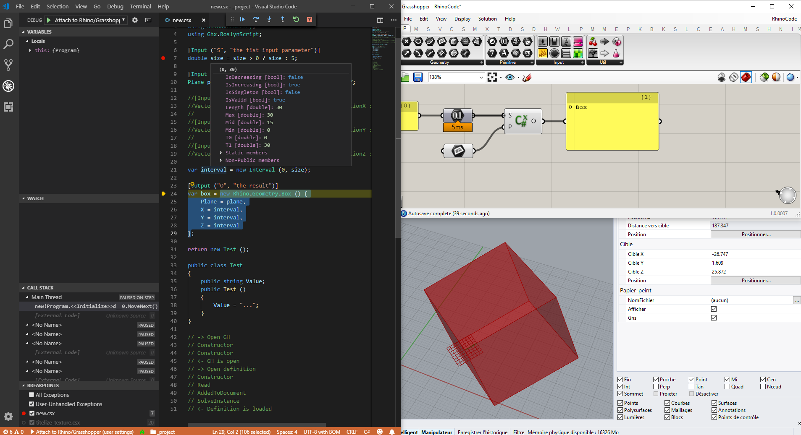
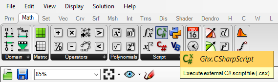
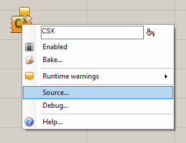
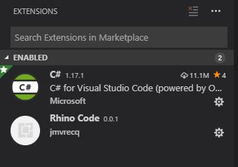

# A [Roslyn Script](https://github.com/dotnet/roslyn/wiki/Scripting-API-Samples) component for Grasshopper

# !!! EXPERIMENTAL

## Features

- Auto compile a csx files
- Auto update inputs/outputs
- Live debugging with vscode/omnisharp
  (The debugger does not reload Rhino and Grasshopper at each compilation, just save the source file)



## Requirements

For live debugging:

- [Visual Studio Code](https://code.visualstudio.com/) installed

## Currently / Known Issues

- Currently is not supported on MacOS (but it's possible)
- Not tested with Data Tree access
- The debugger must be detached to compile the source
- Derived types are not implemented (eg. `class CustomMesh : Mesh {}`)
- If the name of the field (eg. `myVar`) change (->`MyVar`) the grah links are lost

## Install / Use

After installing vscode and compiling the sources, you must have the component under the Math tab.



At first, you have an empty component

Select `Source...` in the component pop-up menu or double-click on the component. A dialog box appear then select a Roslyn script (`*.csx`) or enter a new name.



You must see two files in the target directory

- `libs.csx`
- `<the name you have typed>.csx`

`libs.csx` defines the assembly references that the script needs, like `RhinoCommon.dll`

The second is the script that start with `#lod "./libs.csx"`

This is an example of script:

```cs
#load "./libs.csx"

using Rhino.Geometry;

[Input ("The NickName", "A description of the input")]
var plane;

[Input ("Min")]
double min;

[Input ("Max")]
double max = max > 0 ? max : 1.0; // Define a default value

var interval = new Interval (min, max);

[Output ("B", "Define an output")]
var box = new Box (plane, interval, interval, interval);
```

For debugging, select `Debug...` in the component pop-up menu or double-click on the component again.

Visual Studio Code must start and load your script.

When using for the first time, only one extension must be installed.

> If you have a previous installation of vscode, do not cry!
> Your extensions is not lost. The component launches a special instance of vscode.

Install the [c# extension](https://marketplace.visualstudio.com/items?itemName=ms-vscode.csharp) in this instance. you lust have two extensions enabled:



The `Rhino Code` plugin is in this repository under the `editor` folder.

now, define a breakpoint and press F5.

> If the Rhino process is not found, a selection box asks you to select it.